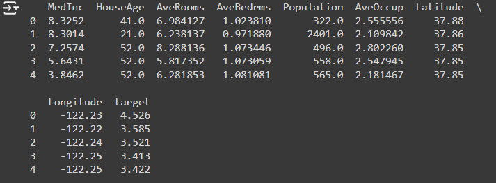
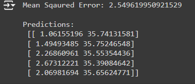

# SGD-Regressor-for-Multivariate-Linear-Regression

## AIM:
To write a program to predict the price of the house and number of occupants in the house with SGD regressor.

## Equipments Required:
1. Hardware – PCs
2. Anaconda – Python 3.7 Installation / Jupyter notebook

## Algorithm
1.Import necessary libraries for data handling, machine learning, and evaluation. Fetch the California housing dataset and create a DataFrame with features and the target.   
2. Select the first three features  and combine the target with the seventh feature.Split the data into training and testing sets.   
3. Apply StandardScaler to normalize both X and Y for training and testing datasets   
4. Initialize an SGDRegressor model.Use MultiOutputRegressor to handle multiple outputs.   
5. Fit the model to the scaled training data.   
6. Predict on the test set.Inverse transform the predictions and test data to their original scale   
7. Calculate the Mean Squared Error (MSE) between the predicted and actual values.Print the MSE and display the first few predictions.   

## Program:
```
/*
Program to implement the multivariate linear regression model for predicting the price of the house and number of occupants in the house with SGD regressor.
Developed by: AKASH KUMAR M.
RegisterNumber: 212223230010 
*/
import numpy as np
import pandas as pd
from sklearn.datasets import fetch_california_housing
from sklearn.linear_model import SGDRegressor
from sklearn.multioutput import MultiOutputRegressor
from sklearn.model_selection import train_test_split
from sklearn.metrics import mean_squared_error
from sklearn.preprocessing import StandardScaler

data=fetch_california_housing()
df=pd.DataFrame(data.data,columns=data.feature_names)
df['target']=data.target
print(df.head())

X=data.data[:,:3]
Y=np.column_stack((data.target,data.data[:,6]))
X_train,X_test,Y_train,Y_test=train_test_split(X,Y,test_size=0.2,random_state=42)
scaler_X=StandardScaler()
scaler_Y=StandardScaler()
X_train=scaler_X.fit_transform(X_train)
X_test=scaler_X.transform(X_test)
Y_train=scaler_Y.fit_transform(Y_train)
Y_test=scaler_Y.transform(Y_test)
sgd=SGDRegressor(max_iter=1000,tol=1e-3)
multi_output_sgd=MultiOutputRegressor(sgd)
multi_output_sgd.fit(X_train,Y_train)
Y_pred=multi_output_sgd.predict(X_test)
Y_pred=scaler_Y.inverse_transform(Y_pred)
Y_test=scaler_Y.inverse_transform(Y_test)
mse=mean_squared_error(Y_test,Y_pred)
print("Mean Sqaured Error:",mse)
print("\nPredictions:\n",Y_pred[:5])
```

## Output:





## Result:
Thus the program to implement the multivariate linear regression model for predicting the price of the house and number of occupants in the house with SGD regressor is written and verified using python programming.
